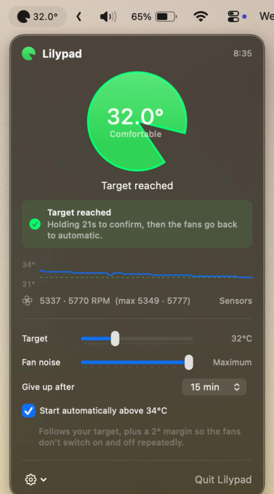
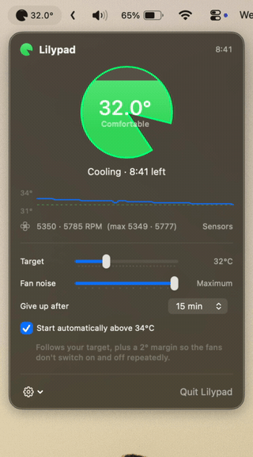

<p align="center">
  
</p>

# Lilypad - Cool your lap!

A menu bar app that takes over your MacBook Pro's fans for a while, so the
bottom case cools down to a temperature that's comfortable on a lap.

Left alone, the firmware runs the fans for the sake of the silicon, not your
legs. It keeps them near idle and only spins them up once the chip itself is
close to throttling — which is a perfectly good rule for the machine, and a bad
one for the person holding it. Long before that point the aluminium underside
has soaked up enough heat to be genuinely uncomfortable, and nothing in macOS
will do anything about it, because as far as the firmware is concerned nothing
is wrong.

Lilypad is the missing knob. It watches the enclosure rather than the die, and
when you ask it to, it runs the fans hard enough to pull the bottom case down to
a temperature you picked.

Click the pad, and Lilypad drives the fans harder than the firmware would on its
own until the enclosure reaches your target temperature — then it hands the fans
straight back to macOS and gets out of the way.

## Tap the pad

<p align="center">
  
</p>

One tap and the fans go from the firmware's idle 1350 RPM to the top of their
range, the pad fills in green as the case cools, and a countdown shows how long
the session has left. When the case reaches your target Lilypad holds the
reading for a few seconds to be sure, then hands the fans back to macOS.

<p align="center">
  
</p>

The panel shows the lap temperature, a live trace of it against your target,
the actual fan RPM with the firmware's own maximum in brackets, and the two
dials that matter: how cool you want the case, and how much fan noise you'll
put up with getting there.

## How it works

macOS exposes fan and temperature control through the System Management
Controller (SMC). Reading it needs no privileges; **writing to it requires
root**. That single fact drives the whole architecture:

| Component | Runs as | Responsibility |
|---|---|---|
| `Lilypad.app` | you | Reads sensors, decides a fan speed, draws the UI |
| `com.lilypad.helper` | root | Writes two SMC keys per fan. Nothing else. |

They talk over XPC. The helper is deliberately dumb — it knows nothing about
temperatures or targets, so the amount of code running as root stays as small as
it can be.

### The keys involved

Enumerating all 3501 SMC keys on an M5 Pro MacBook Pro (Mac17,8) turns up
exactly two writable keys per fan — everything else is read-only:

| Key | Attr | Meaning |
|---|---|---|
| `F0md` | `0xd0` | Fan 0 mode: `0` = firmware control, `1` = forced |
| `F0Tg` | `0xd4` | Fan 0 target RPM (IEEE float) |
| `F0Ac` | `0x84` | Fan 0 actual RPM (read-only) |
| `F0Mn` / `F0Mx` | `0x84`/`0x85` | Firmware's own min/max, e.g. 1350–5349 |

Note the lowercase `md`. Intel Macs used `F0Md`; this generation uses `F0md`.
`FanController` probes both spellings.

### Which temperature is "lap temperature"

Not the one most tools show you. The `Tp??` p-core die sensors idle around
50 °C, but that is the silicon, not the aluminium against your legs. Lilypad
uses the sensors that actually sit on the bottom case:

- `Ts0P` / `Ts1P` — enclosure skin, ~30 °C at idle
- `TB0T` / `TB1T` / `TB2T` — battery, the largest thermal mass directly under
  the bottom case

The lap reading is the hottest of those. Die sensors are still read, but only as
a safety interlock. There are further enclosure sensors (`TDBP`, `TDEL`, `TDER`
…) whose exact placement Apple doesn't document; they're shown in the sensor
list and can be folded into the reading from the gear menu.

The comfort labels follow ordinary contact-comfort guidance — skin stops reading
a surface as neutral around 33 °C, and sustained contact above roughly 42 °C is
where low-temperature burn advice begins. Default target is 34 °C.

### Fan speed is open loop, and that is on purpose

The Fan noise slider sets a speed directly — "Maximum" means the firmware's
maximum RPM — and that speed is held constant for the whole session. It does
not vary with how close the case is to the target.

Two earlier attempts got this wrong, both by modulating on the error:

1. A ceiling with a 5 °C proportional band. Case temperature moves in far too
   narrow a range for a band that wide, so the fans sat at 44% while the slider
   read "Maximum".
2. A taper over the last 1 °C. This oscillated: the fans respond in seconds but
   the case takes minutes, so easing off near the target let the case warm
   straight back up, which wound the fans up again. Audible as constant
   surging, and it never settled.

Holding one speed until the target is actually reached is both quieter and
faster. The only remaining variation is the die-temperature override, which
goes to maximum regardless.

## Safety

Handing your fans to a third-party app deserves scepticism, so the design
assumes the app will misbehave:

- **Only ever adds cooling.** The commanded speed is floored at whatever the
  firmware was already asking for when Lilypad took over. Engaging it can never
  make the machine run hotter than leaving it alone.
- **Clamped to the firmware's own range.** Every requested RPM is clamped into
  `[F0Mn, F0Mx]` by the *helper*, not the app, so a bug in the app can't drive a
  fan outside limits Apple already permits.
- **Heartbeat watchdog.** The app must keep talking to the helper. Eight seconds
  of silence — crash, hang, force-quit, `kill -9` — and the fans go back to
  firmware control on their own.
- **Hard session ceiling.** One hour maximum, whatever the app asks for.
- **Crash recovery.** If the helper itself is killed mid-session, it releases
  any still-forced fan the next time it launches.
- **Thermal override.** If any die sensor exceeds 95 °C, the fans go to maximum
  regardless of your noise preference.

Worst realistic failure is a laptop that's briefly louder than you wanted.

## Setup

1. Build and run (⌘R in Xcode), or use the copy in `/Applications`.
2. Open the menu and click **Enable fan control**. You'll be asked for your
   administrator password **once** — this installs the helper as a LaunchDaemon.
3. Click the pad.

The installer refuses to install a helper binary that isn't signed by this
project's Team ID, and the helper refuses XPC connections from anything that
isn't the signed Lilypad app. If you build with a different signing identity,
update `HelperInfo.clientTeamIdentifier` in `Shared/HelperProtocol.swift`.

### Removing it

Gear menu → **Remove helper…**, or by hand:

```bash
sudo launchctl bootout system/com.lilypad.helper; sudo rm -f /Library/LaunchDaemons/com.lilypad.helper.plist /Library/PrivilegedHelperTools/com.lilypad.helper
```

## Layout

```
Lilypad/
├── Shared/              compiled into BOTH targets
│   ├── SMCKit.swift         IOKit transport + value decoding
│   ├── FanControl.swift     fan discovery, clamping, force/release
│   └── HelperProtocol.swift the XPC contract
├── Lilypad/             the menu bar app (unprivileged)
│   ├── Core/                sensors, control loop, XPC client, installer
│   └── UI/                  menu panel and the pad mark
├── LilypadHelper/       the root daemon
└── docs/                the images in this README
```
